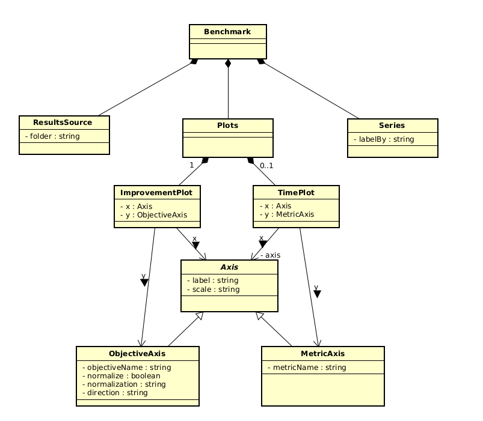

# Benchmark Module Architecture

Date: 09 Nov 2025 (updated)

## Current Components

- `orchestrate_benchmark.py`
  - Provides `run_benchmark()`, `analyze()` and high-level `orchestrate()` combining both
  - CLI: `--mode benchmark|analyse`, optional `--skip-analyzer`.
  - Responsible for life-cycle scenario execution and analyzer run.

- `benchmark_runner.py`
  - `BRISEBenchmarkRunner` encapsulates benchmark scenarios and interaction with Main Node via `MainAPIClient`.
  - Scenario examples: `benchmark_test()`, `fill_db()`.
  - Produces `.pkl` experiment dumps under `./results/serialized/`.

- `poc_analyzer.py`
  - Modular analyzer pipeline (v1) => will be split into different files later.
    - DataLoader: load dumps
    - MetricExtractor: discover numeric objectives (Y1..YN), extract per-iteration series
    - Normalizer: apply chosen normalization (e.g. minimize over experiments)
    - PlotBuilder: robust axis scaling (quantile padding) and best-so-far computation
    - ReportBuilder: multi-tab HTML report (one tab per objective) + summary table + csv file
  - Features:
    - Multi-objective auto-discovery (numeric keys within configuration results)
    - Direction-aware improvement computation (minimize / maximize)
    - Clean table & plot rendering
  - Work in progress:
    - Auto-open HTML report
    - Refactoring (into multiple files and folders)
    - Enhance naming of test files and experiments for clarity

- `benchmark_template.json` && `benchmark_template.wfl`
  - Analyzer configuration: results folder, preferred improvement objective, direction, normalization method, optional time metric.
## Waffle Benchmark Schema

## Sequence Diagram

