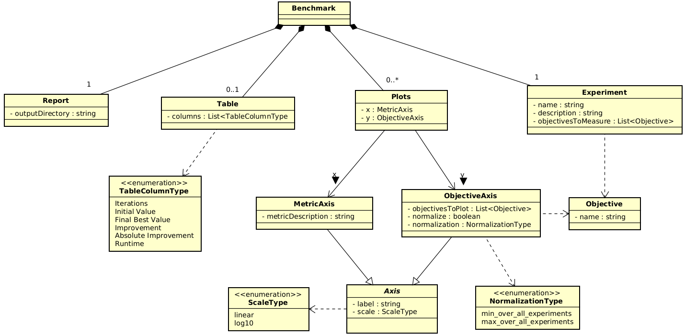

# Benchmark

Service for running benchmark tests and performing a comparative analysis of experiment results.
Designed for understanding, interpreting and assessment of the experiments' results.

---

## Requirements

To use `benchmark` mode:
- Run [main-node](../main_node/README.md "Main node Readme."), at least one [worker](../worker/README.md), [worker-service](../worker_service/README.md "Worker service Readme."), [event-service](../event_service/README.md). The easiest way to do so is by using the next `../brise.sh` command:  
  `../brise.sh up -m docker-compose -s main-node worker worker_service event_service`
- Define the Domain Name for the `event-service` on the host-machine as IP of a machine where the event service is running. In case of running on the same machine set it the same as `localhost` in your environment.
- NOTE: The benchmark looking for `event-service` on the 49153 port. For that reason be careful with changing AMQP port by using `../brise.sh`.

---

## Usage
__We strongly recommend to execute and control benchmark tests and analysis only in a dockerized way using provided `./init.sh` control script.__

##### Configure benchmark using Waffle (recommended)
1. Start the Waffle configuration wizard:
   ```bash
   ./init.sh waffle
   ```
   This will:
   - Start the Waffle service via docker-compose
   - Open your browser to http://localhost:8001/wizard/initialize/
   
2. In the Waffle wizard:
   - Copy and paste the content of `benchmark_template.wfl` into the text field
   - Click "Configure product manually"
   - Fill in the required fields:
     - `Benchmark.ExperimentSeries.Name`: Name for your experiment series
     - `Benchmark.ExperimentSeries.Description`: Description of your benchmark
     - `Benchmark.Resources.Folder`: Path to results folder (e.g., `./results/serialized/`)
     - ...
     - Configure plot settings for Improvement and Time plots as needed
   - Click "Download configured product" to get `configuration.json`
   
3. Save the downloaded file as `./benchmark/configuration.json`

4. Run the benchmark and analysis:
   ```bash
   ./init.sh up benchmark
   ```
   
   After completion, the results will automatically open in your browser!
   You can also manually open the report anytime with:
   ```bash
   ./init.sh show_report
   ```

##### Cleaning Up Generated Files

After and before running benchmarks, you can clean up all generated files (`.pkl`, `.csv`, `.html`, `.zip`):

```bash
./init.sh cleanup
```

This removes:
- All experiment dumps (`.pkl` files) from `./results/serialized/`
- All CSV files (benchmark results) from `./results/`
- All HTML reports from `./results/`
- All ZIP archives from `./results/`

##### Exporting Plots as SVG

The generated HTML report includes "Export as SVG" buttons for each plot. Simply:
1. Open the report in your browser (`./init.sh show_report`)
2. Navigate to the plot you want to export
3. Click the "Export as SVG" button below the plot
4. The SVG file will be downloaded to your default downloads folder

This allows you to use high-quality vector graphics in presentations and publications.

---

## Architecture Overview

### Current Components

The benchmark system is built with a modular, pipeline-based architecture:

#### Orchestration Layer
- **`orchestrate_benchmark.py`** (Main entry point)
  - Provides `run_benchmark()`, `analyze()` and high-level `orchestrate()` combining both
  - CLI: `--mode benchmark|analyse|cleanup`, optional `--skip-analyzer` and `--cleanup` flags
  - Responsible for life-cycle scenario execution and analyzer run
  - Now includes integrated analyzer initialization

#### Benchmark Execution
- **`benchmark_runner.py`**
  - `BRISEBenchmarkRunner` encapsulates benchmark scenarios and interaction with Main Node via `MainAPIClient`
  - Scenario examples: `benchmark_test()`, `fill_db()`
  - Produces `.pkl` experiment dumps under `./results/serialized/`

#### Analysis Pipeline (Refactored Modular Architecture)
The analyzer follows a clean pipeline architecture with separated concerns:

- **`analyzer/config/`** - Configuration Management
  - `benchmark_config.py`: Configuration data classes and JSON parsing

- **`analyzer/data_pipeline/`** - Data Processing Pipeline
  - `experiment_loader.py`: Load experiment dumps from disk
  - `experiment_parser.py`: Parse and validate experiment data
  - `metric_extractor.py`: Auto-discover objectives (Y1..YN), extract per-iteration series
  - `data_processor.py`: Normalize and transform data (minimize/maximize, normalization methods)

- **`analyzer/visualization/`** - Report Generation
  - `plot_generator.py`: Generate improvement and time plots with robust axis scaling
  - `table_generator.py`: Generate summary tables and statistics
  - `report_generator.py`: Build multi-tab HTML reports with embedded plots

- **`analyzer/orchestration/`** - High-Level Coordination
  - `benchmark_analyzer.py`: Main analyzer orchestrator coordinating the entire pipeline

#### Key Features
- **Multi-objective auto-discovery**: Automatically detects numeric objectives in results
- **Direction-aware improvement**: Supports both minimize and maximize optimization
- **Flexible normalization**: Multiple normalization methods (min-over-experiments, etc.)
- **Robust visualization**: Quantile-based axis scaling, best-so-far computation
- **Clean separation**: Each component has a single, well-defined responsibility

#### Configuration
- **`configs/benchmark_templates/`** - JSON configuration templates
  - Analyzer configuration: results folder, improvement objectives, direction, normalization method, time metrics
- **`configs/benchmark_feature_model/benchmark_feature_model.wfl`** 
  - Waffle feature model for configuration wizard

### Architecture Diagrams

#### Waffle Benchmark Schema


#### Detailed Architecture References
For detailed architecture documentation, see:
- **[Architecture Overview](docs/class_diagram/Benchmark_Class_Diagram_Overview.png)** - Simplified component diagram showing the core architecture
- **[Benchmark_Sequence_BRISE_High_Level_Flow.png](docs/benchmark_workflow/Benchmark_Sequence_BRISE_High_Level_Flow.png)** - High-level benchmark execution flow

---

## Configuration File Structure

The downloaded `configuration.json` should have this structure:

```json
{
  "Benchmark": {
    "Resources": {
      "Folder": "./results/serialized/"
    },
    "ExperimentSeries": {
      "Name": "MyBenchmark",
      "Description": "Description of the benchmark"
    },
    "Plots": {
      "Improvement": {
        "X": { ... },
        "Y": { ... }
      },
      "Time": {
        "X": { ... },
        "Y": { ... }
      }
    }
  }
}
```

See `configuration.json.example` for a complete example.

## Workflow Diagram

```
┌─────────────────┐
│  Start Waffle   │
│ ./init.sh waffle│
└────────┬────────┘
         │
         ▼
┌─────────────────────────────┐
│ Open http://localhost:8001  │
│  /wizard/initialize/        │
└────────┬────────────────────┘
         │
         ▼
┌─────────────────────────────┐
│ Paste benchmark_template.wfl│
│ Click "Configure manually"  │
└────────┬────────────────────┘
         │
         ▼
┌─────────────────────────────┐
│ Fill in configuration fields│
│ - Name, Description         │
│ - Folder paths              │
│ - Plot settings             │
└────────┬────────────────────┘
         │
         ▼
┌─────────────────────────────┐
│ Download configuration.json │
│ Save to benchmark/ folder   │
└────────┬────────────────────┘
         │
         ▼
┌─────────────────────────────┐
│  Run benchmark analysis     │
│  ./init.sh up benchmark     │
└─────────────────────────────┘
```

##### Plan and run benchmark tests
The general idea of writing benchmark scenario - automation of Experiment Description generation and execution.
1. Write your own benchmarking scenario as a separate method in class `BRISEBenchmarkRunner`.
    - The atomic step of scenario - you have generated complete valid Experiment Description and
    called `self.execute_experiment` passing this description as an argument.
    - You could mark your benchmarking scenario as `@benchmarkable` to calculate the number of Experiments
    that are going to be performed before their actual execution and check the overall process of Scenarios generation.
2. Add execution of this scenario in `run_benchmark` function of `orchestrate_benchmark.py` module.
3. Build an image, create a container and run the benchmark by calling `./init.sh up benchmark`
    * in case of failure you could restart benchmarking by running `./init.sh restart benchmark`.
    * benchmark enabled with __warm startup__ feature - in case of restart, the Experiments that were already performed
    and stored in storage folder will be detected and skipped. Be aware that this feature fully relies on a content of
    the Experiment Description - benchmarking script calculates hash of Experiment that is going to be executed and
    checks if Experiment Dump(s) with this hash is(are) already in a storage. If you change base Experiment Description content
    between benchmarking it will not work.

##### Run analysis standalone
You can run analysis on previously generated experiment dumps without running benchmarks:

1. Ensure experiment dumps are in folder `./results/serialized/`
2. Run analysis using one of these methods:
   ```bash
   # Using init.sh
   ./init.sh up analyse
   ```
3. Generated Reports are on default auto-opened in your browser:
   - Reports are stored in `./results/reports/` directory
---

## Project Structure

#### Analysis Pipeline
Modular analyzer with clear separation of concerns:

```
analyzer/
├── config/                    # Configuration management
│   ├── __init__.py
│   └── benchmark_config.py    # Config data classes and JSON parsing
│
├── data_pipeline/             # Data loading and processing
│   ├── __init__.py
│   ├── experiment_loader.py   # Load .pkl dumps from disk
│   ├── experiment_parser.py   # Parse and validate experiments
│   ├── metric_extractor.py    # Auto-discover objectives and extract metrics
│   └── data_processor.py      # Normalize and transform data
│
├── visualization/             # Report and plot generation
│   ├── __init__.py
│   ├── plot_generator.py      # Generate improvement/time plots
│   ├── table_generator.py     # Generate summary tables
│   └── report_generator.py    # Build HTML reports
│
└── orchestration/             # High-level coordination
    ├── __init__.py
    └── benchmark_analyzer.py  # Main analyzer orchestrator
```

### Configuration and Templates
- **`configs/benchmark_templates/`** - JSON configuration templates
- **`configs/benchmark_feature_model/`** - Waffle feature model for configuration wizard
- **`template/`** - HTML report templates

### Results and Output
- **`results/serialized/`** - Experiment dumps (`.pkl` files)
- **`results/reports/`** - Generated HTML reports and CSV files

### Utilities
- **`util/shared_tools.py`** - Helper tools for file operations and utilities

### Legacy Components
- **`util/benchmark_analyser.py`** - Legacy analyzer (deprecated, kept for reference)

---

## Data Flow

1. **Benchmark Execution** (`orchestrate_benchmark.py` → `benchmark_runner.py`)
   - User defines and instantiates benchmark configuration
   - User defines scenarios in `BRISEBenchmarkRunner`
   - Runner generates Experiment Descriptions
   - `MainAPIClient` executes experiments via Main Node API
   - Results saved as `.pkl` dumps in `./results/serialized/`

2. **Analysis Pipeline** (`orchestrate_benchmark.py` → `analyzer/`)
   - `BenchmarkAnalyzer` orchestrates the pipeline:
     - **Load**: `ExperimentLoader` reads `.pkl` files
     - **Parse**: `ExperimentParser` validates and structures data
     - **Extract**: `MetricExtractor` discovers objectives and extracts metrics
     - **Process**: `DataProcessor` normalizes and transforms data
     - **Visualize**: 
       - `PlotGenerator` creates improvement/time plots
       - `TableGenerator` creates summary statistics
       - `ReportGenerator` assembles HTML report
   - Output: HTML report and CSV files in `./results/reports/`

---

## Play Around with Code

Benchmark module currently can be extended and modified with the dependencies listed in the [environment.yml](environment.yml) file.